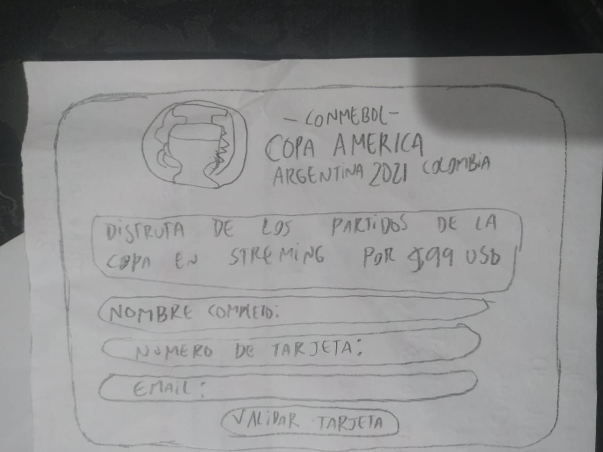
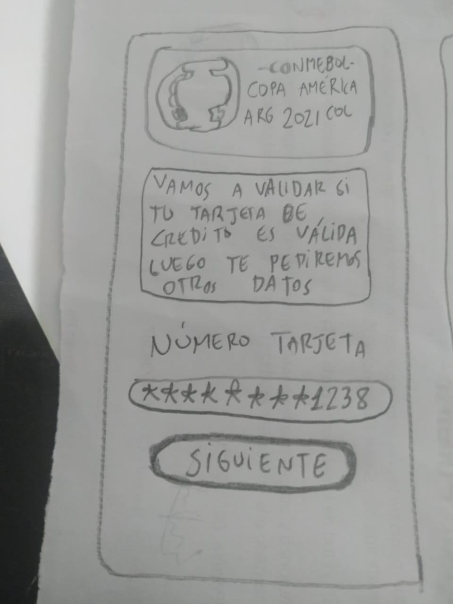
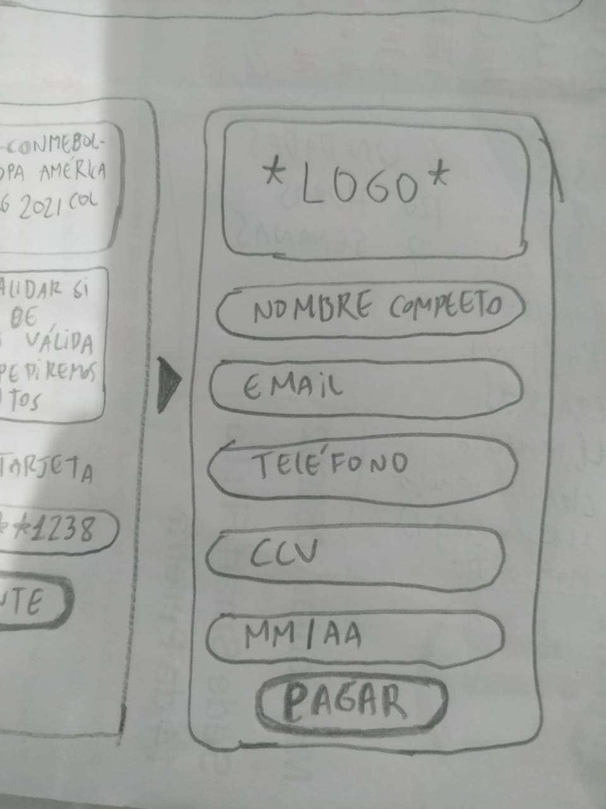
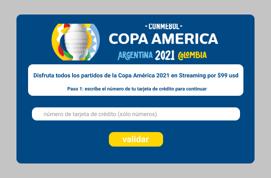

# Tarjeta de crédito válida

## 1. Descripción del proyecto

  Se acerca la [copa América de fútbol 2021](https://es.wikipedia.org/wiki/Copa_Am%C3%A9rica_2021) y nadie quiere perderse de este evento, muchas personas no tienen televisor o tv cable en casa para ver este evento deportivo.
La Conmebol ha pensado en ello y ha habilitado un sitio web para ver los partidos en streaming, por un costo de 100 dólares que incluye todos los partidos, con repeticiones grabadas.

## 2. Investigación UX

- **Usuarios**: Personas de todo el mundo que cuenten con una tarjeta de crédito válida para realizar el pago del acceso a la plataforma de streaming.
- **Objetivo**: poder ver los partidos de la Copa América desde cualquier parte del mundo a una buena resolución (mejor que la señal standard de televisión).
- **Problema a Solucionar**: Mucha gente se encuentra en zonas donde no hay buena cobertura de televisión o incluso no cuentan con este servicio en sus casas, lugares de trabajo, estas personas desean ver en vivo los partidos de la Copa América, por eso esta plataforma permitirá realizar el pago para acceder por streaming a los partidos en vivo.

- **Prototipo en Papel** (baja fidelidad)

Version Desktop:

Version Mobile:

- Feedback recibido: mi compañera Eliana, me indicó que podría pedirse sólo el número de la tarjeta y luego si es válida, pedir los demás datos: nombre completo, email, celular, fecha de vencimiento y código seguridad. de acuerdo a esto se diseñó el siguiente prototipo en figma en alta fidelidad

- **Prototipo en Figma** (alta fidelidad)

[Prototipo en Figma.](https://www.figma.com/file/ZrlRQHD2GwCJHzdsrvJIl8/Card-validation?node-id=0%3A1)

## 3. plan de acción

Objetivos de aprendizaje

### HTML y CSS

* [ ] [Uso de HTML semántico.](https://developer.mozilla.org/en-US/docs/Glossary/Semantics#Semantics_in_HTML)

* [ ] Uso de selectores de CSS.

* [ ] Construir tu aplicación respetando el diseño realizado (maquetación).

### DOM

* [ ] Uso de selectores del DOM.

* [ ] Manejo de eventos del DOM.

* [ ] [Manipulación dinámica del DOM.](https://developer.mozilla.org/es/docs/Referencia_DOM_de_Gecko/Introducci%C3%B3n)

(appendChild |createElement | createTextNode| innerHTML | textContent | etc.)

### JavaScript

* [ ] Manipulación de strings.

* [ ] Uso de condicionales (if-else | switch | operador ternario)

* [ ] Uso de bucles (for | for..in | for..of | while)

* [ ] Uso de funciones (parámetros | argumentos | valor de retorno)

* [ ] Declaración correcta de variables (const & let)

### Testing

* [ ] [Testeo unitario.](https://jestjs.io/docs/es-ES/getting-started)

### Estructura del código y guía de estilo

* [ ] Organizar y dividir el código en módulos (Modularización)

* [ ] Uso de identificadores descriptivos (Nomenclatura | Semántica)

* [ ] Uso de linter (ESLINT)

### Git y GitHub

* [ ] Uso de comandos de git (add | commit | pull | status | push)

* [ ] Manejo de repositorios de GitHub (clone | fork | gh-pages)

### UX

* [ ] Diseñar la aplicación pensando y entendiendo al usuario.

* [ ] Crear prototipos para obtener feedback e iterar.

* [ ] Aplicar los principios de diseño visual (contraste, alineación, jerarquía)

## 4. Demo